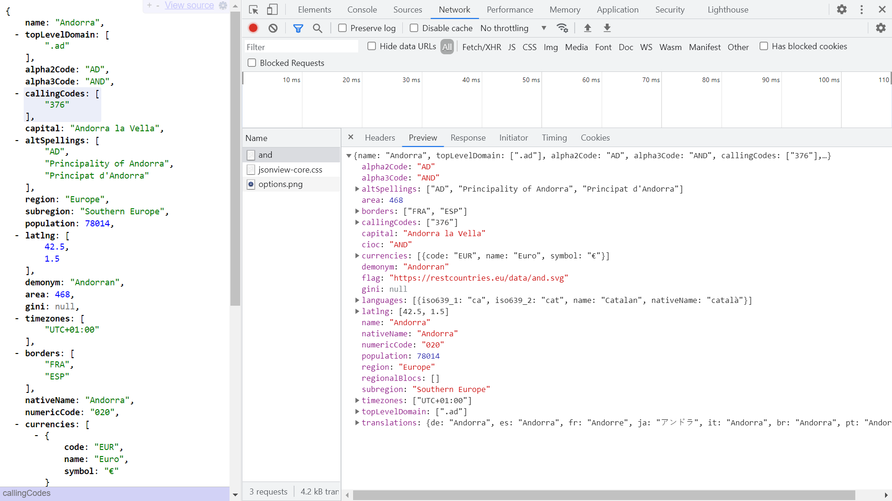

# :zap: Svelte Tailwind SSR

* Sveltejs kit used to display API data
* **Note:** to open web links in a new window use: _ctrl+click on link_


## :page_facing_up: Table of contents

* [:zap: Svelte Rollup Crypto](#zap-svelte-rollup-crypto)
  * [:page_facing_up: Table of contents](#page_facing_up-table-of-contents)
  * [:books: General Info](#books-general-info)
  * [:camera: Screenshots](#camera-screenshots)
  * [:signal_strength: Technologies](#signal_strength-technologies)
  * [:floppy_disk: Setup](#floppy_disk-setup)
  * [:computer: Code Examples](#computer-code-examples)
  * [:clipboard: Status & To-Do List](#clipboard-status--to-do-list)
  * [:clap: Inspiration](#clap-inspiration)
  * [:file_folder: License](#file_folder-license)
  * [:envelope: Contact](#envelope-contact)

## :books: General info

* tba

## :camera: Screenshots



## :signal_strength: Technologies

* [Sveltejs/kit v3](https://svelte.dev/) fast front-end UI library with small bundles of highly-optimized vanilla JavaScript & declarative transitions. Does not use a virtual DOM.

## :floppy_disk: Setup

* `npm i` to install dependencies
* `npm run dev` to run dev server
* `npm run build` to build optimised version
* `npm run start` to run the newly built app

## :wrench: Testing

* N/A

## :computer: Code Examples

* tba

```svelte

```

## :cool: Features

* compact build folder

## :clipboard: Status & To-Do List

* Status: In work
* To-Do: complete

## :clap: Inspiration

* tba

## :file_folder: License

* N/A

## :envelope: Contact

* Repo created by [ABateman](https://github.com/AndrewJBateman), email: gomezbateman@yahoo.com
