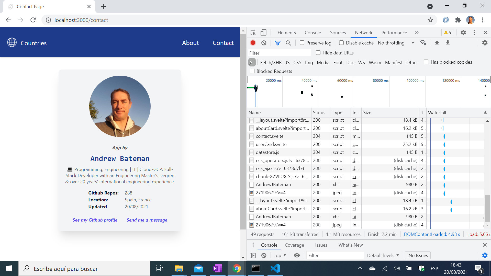
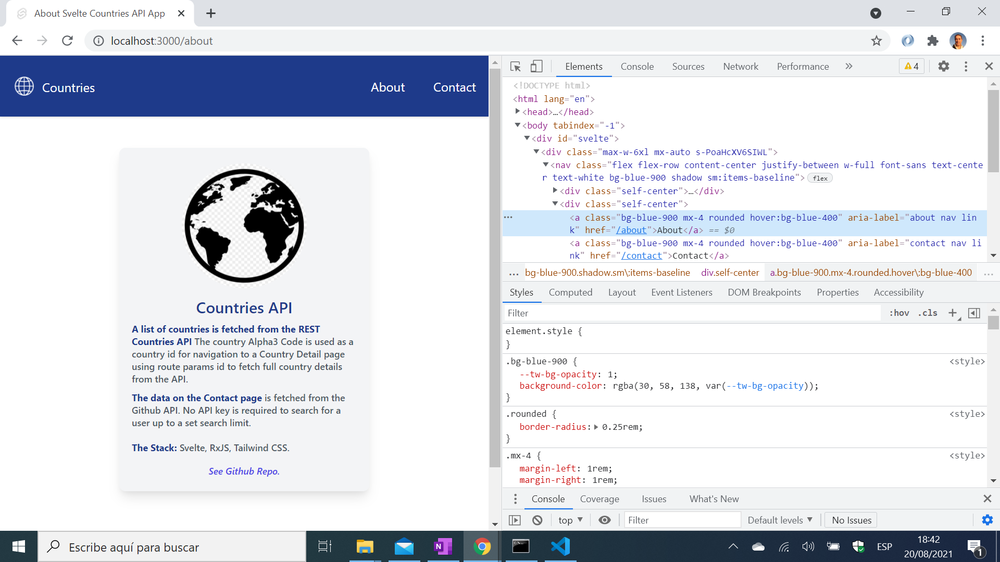

# :zap: Svelte Tailwind SSR

* Sveltejs kit used with Vite and RxJS & Tailwind CSS to display country & Github API data
* Latest vite/Svelte3 folder layout using `+page.server.ts` to fetch server-side data to pass to `+page.svelte` client page.
* **Note:** to open web links in a new window use: _ctrl+click on link_


## :page_facing_up: Table of contents

* [:zap: Svelte Tailwind SSR](#zap-svelte-tailwind-ssr)
	* [:page\_facing\_up: Table of contents](#page_facing_up-table-of-contents)
	* [:books: General info](#books-general-info)
	* [:camera: Screenshots](#camera-screenshots)
	* [:signal\_strength: Technologies](#signal_strength-technologies)
	* [:floppy\_disk: Setup](#floppy_disk-setup)
	* [:wrench: Testing](#wrench-testing)
	* [:computer: Code Examples](#computer-code-examples)
	* [:cool: Features](#cool-features)
	* [:clipboard: Status \& To-Do List](#clipboard-status--to-do-list)
	* [:clap: Inspiration](#clap-inspiration)
	* [:file\_folder: License](#file_folder-license)
	* [:envelope: Contact](#envelope-contact)

## :books: General info

* Displays grid of Tailwind-styled cards, one for each country
* Tailwind CSS card markup shown using separate card components
* Search bar shows all countries that match the user search text
* Country detail page uses the country alpha3 code in lower case as the unique id passed by route params.
* About page gives details of the app with a Github link
* Contact page gives info. on the author via the Github API
* API endpoint: `http://localhost:3000/api/countries/` shows all countries
* API endpoint: `http://localhost:3000/api/countries/id` shows country with matching id
* Unused Tailwind CSS is purged during build which makes for a much lighter bundle
* [REST API Endpoints](https://restcountries.eu/#api-endpoints-code)

## :camera: Screenshots






## :signal_strength: Technologies

* [Sveltejs/kit v1](https://kit.svelte.dev/) Svelte & Vite-based framework
* [Svelte v3](https://svelte.dev/) React-based & created by Facebook (Meta), it is a fast, light and efficient front-end UI library/compiler that converts code to small bundles of highly-optimized ES6 vanilla JavaScript & declarative transitions. Does not use a virtual DOM. I have had to completely restructure the app due to Svelte/vite breaking version changes. A lot of companies use Svelte
* [Vite v4](https://www.npmjs.com/package/vite) Frontend Tooling dev server and build command for optimised build static assets.
* [RxJS v7](https://rxjs.dev/) Reactive Extensions Library for JavaScript
* [Tailwind CSS v3](https://tailwindcss.com/) CSS framework
* [Tailwind Colour Palette](https://tailwindcss.com/docs/customizing-colors#color-palette-reference)
* [Online color converter, hex to Tailwind](https://tailwind-color-finder.vercel.app/)
* [REST Countries API v2](https://restcountries.eu/) RESTful API with data on all world countries

## :floppy_disk: Setup

* `npm i` to install dependencies
* `npm run dev` to run dev server on port `localhost:3000`
* `npm run build` to build optimised version
* `npm run preview` to run the newly built app

## :wrench: Testing

* N/A

## :computer: Code Examples

* `store/datastore.ts` functions to fetch JSON data from Github & Restcountries APIs

```typescript
// Fetch user data from Github REST API
const baseUrl = 'https://api.github.com/users/';
const userSearchUrl = `${baseUrl + 'AndrewJBateman'}`;
export const user = ajax({
	url: userSearchUrl
}).pipe(
	map((x) => x.response),
	startWith([])
);

// Fetch JSON data - 3 fields only - for all countries from Restcountries API
export const fetchCountries = async () => {
	const url = 'https://restcountries.com/v2/all?fields=name,flag,alpha3Code';
	const res = await fetch(url);
	const data = await res.json();
	const loadedData = data.map((data) => ({
		name: data.name,
		id: data.alpha3Code.toLowerCase(),
		image: data.flag
	}));
	countries.set(loadedData);
};

// Fetch JSON data on country with alpha3 code matching id from Restcountries API
export const fetchCountryById = async (id) => {
	if (countryDetails[id]) return countryDetails[id];

	try {
		const url = `https://restcountries.com/v2/alpha/${id}`;
		const res = await fetch(url);
		const data = await res.json();
		countryDetails[id] = data;
		return data;
	} catch (err) {
		console.error(err);
		return null;
	}
};
```

## :cool: Features

* Search input filtering
* No API keys required
* Tailwind results in a very compact bundle and helps with Lighthouse audit

## :clipboard: Status & To-Do List

* Status: Working
* To-Do: Change to API v3. Publish. Check Lighthouse score. Optimise for SSR. Add PWA? Add more API pages with nav-bar links. Add leaflet maps?

## :clap: Inspiration

* [James Q Quick: SvelteKit Crash Course - SSR, API Routes, Stores, Tailwind CSS, and More!](https://www.youtube.com/watch?v=UU7MgYIbtAk&t=63s)
* [Support trailing $ name convention for stores (Observables)](https://www.gitmemory.com/issue/sveltejs/svelte/6373/851059020)
* [Learn RXJS ajax example](https://www.learnrxjs.io/learn-rxjs/operators/creation/ajax)
* [MDN: Date.prototype.toLocaleString()](https://developer.mozilla.org/en-US/docs/Web/JavaScript/Reference/Global_Objects/Date/toLocaleString)
* [netlify: Migrating Breaking Changes in SvelteKit](https://www.netlify.com/blog/migrating-breaking-changes-in-sveltekit/)

## :file_folder: License

* This project is licensed under the terms of the MIT license.

## :envelope: Contact

* Repo created by [ABateman](https://github.com/AndrewJBateman), email: gomezbateman@yahoo.com
