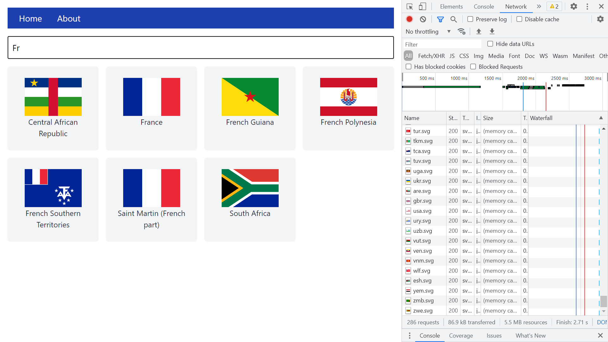
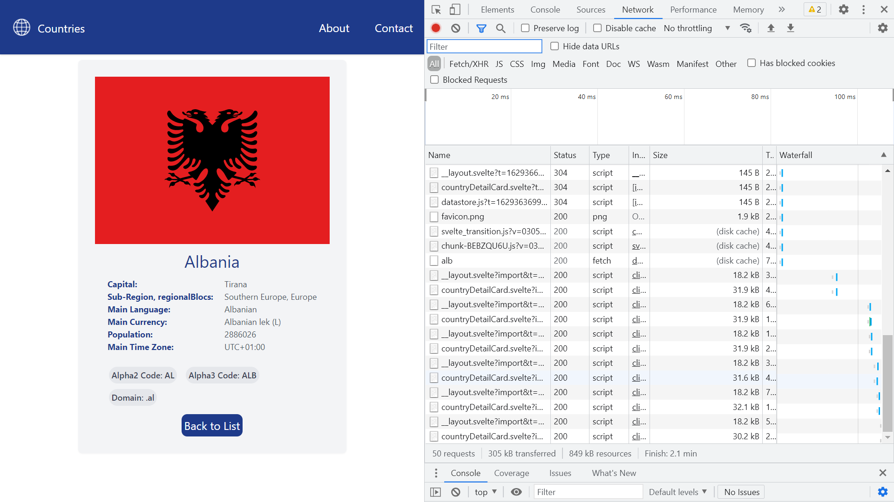

# :zap: Svelte Tailwind SSR

* Sveltejs kit used with Tailwind CSS to display country API data
* Code from [James Q Quick](https://www.youtube.com/channel/UC-T8W79DN6PBnzomelvqJYw) - see [:clap: Inspiration](#clap-inspiration) below - but using a different API, styling, navigation and grid layout. I recommend his tutorials - they are well explained.
* **Note:** to open web links in a new window use: _ctrl+click on link_


## :page_facing_up: Table of contents

* [:zap: Svelte Rollup Crypto](#zap-svelte-rollup-crypto)
  * [:page_facing_up: Table of contents](#page_facing_up-table-of-contents)
  * [:books: General Info](#books-general-info)
  * [:camera: Screenshots](#camera-screenshots)
  * [:signal_strength: Technologies](#signal_strength-technologies)
  * [:floppy_disk: Setup](#floppy_disk-setup)
  * [:computer: Code Examples](#computer-code-examples)
  * [:clipboard: Status & To-Do List](#clipboard-status--to-do-list)
  * [:clap: Inspiration](#clap-inspiration)
  * [:file_folder: License](#file_folder-license)
  * [:envelope: Contact](#envelope-contact)

## :books: General info

* Displays grid of Tailwind-styled cards, one for each country
* Tailwind card data shown using separate card components
* Search bar shows all countries that match the user search text
* Country detail page uses the country alpha3 code in lower case as the unique id passed by route params.
* About page gives details of the app and Github link
* Contact page gives info. on the author via the Github API
* API endpoint: `http://localhost:3000/api/countries/` shows all countries
* API endpoint: `http://localhost:3000/api/countries/id` shows country with matching id
* Unused Tailwind CSS is purged during build which makes for a much lighter bundle
* [REST API Endpoints](https://restcountries.eu/#api-endpoints-code)

## :camera: Screenshots





## :signal_strength: Technologies

* [Sveltejs/kit v3](https://kit.svelte.dev/) fast front-end UI library with small bundles of highly-optimized vanilla JavaScript & declarative transitions. Does not use a virtual DOM.
* [Tailwind v2](https://tailwindcss.com/) CSS framework
* [Tailwind Colour Pallete](https://tailwindcss.com/docs/customizing-colors#color-palette-reference)
* [Online color converter, hex to Tailwind](https://tailwind-color-finder.vercel.app/)
* [REST Countries API v2](https://restcountries.eu/) RESTful API with data on all world countries

## :floppy_disk: Setup

* `npm i` to install dependencies
* `npm run dev` to run dev server on port `localhost:3000`
* `npm run build` to build optimised version
* `npm run start` to run the newly built app

## :wrench: Testing

* N/A

## :computer: Code Examples

* `stores/datastore.js` functions to fetch JSON data from a REST API

```javascript
// Fetch JSON data - 3 fields only - for all countries from a REST API
export const fetchCountries = async () => {
	const url = 'https://restcountries.eu/rest/v2/all?fields=name;flag;alpha3Code';
	const res = await fetch(url);
	const data = await res.json();
	const loadedData = data.map((data) => ({
		name: data.name,
		id: data.alpha3Code.toLowerCase(),
		image: data.flag
	}));
	countries.set(loadedData);
};

// Fetch JSON data on country with alpha3 code matching id from a REST API
export const fetchCountryById = async (id) => {
	if (countryDetails[id]) return countryDetails[id];

	try {
		const url = `https://restcountries.eu/rest/v2/alpha/${id}`;
		const res = await fetch(url);
		const data = await res.json();
		countryDetails[id] = data;
		return data;
	} catch (err) {
		console.error(err);
		return null;
	}
};
```

## :cool: Features

* Search input filtering
* Tailwind results in a very compact bundle and helps with Lighthouse audit

## :clipboard: Status & To-Do List

* Status: Part Working. Contact page Github API observable not being subscribed to.
* To-Do: Fix contact page Github API observable issue. population number - add commas REGEX?

## :clap: Inspiration

* [James Q Quick: SvelteKit Crash Course - SSR, API Routes, Stores, Tailwind CSS, and More!](https://www.youtube.com/watch?v=UU7MgYIbtAk&t=63s)
* [Support trailing $ name convention for stores (Observables)](https://www.gitmemory.com/issue/sveltejs/svelte/6373/851059020)

## :file_folder: License

* N/A

## :envelope: Contact

* Repo created by [ABateman](https://github.com/AndrewJBateman), email: gomezbateman@yahoo.com
